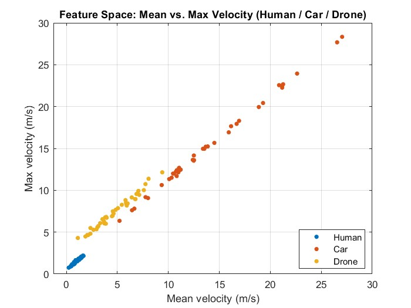
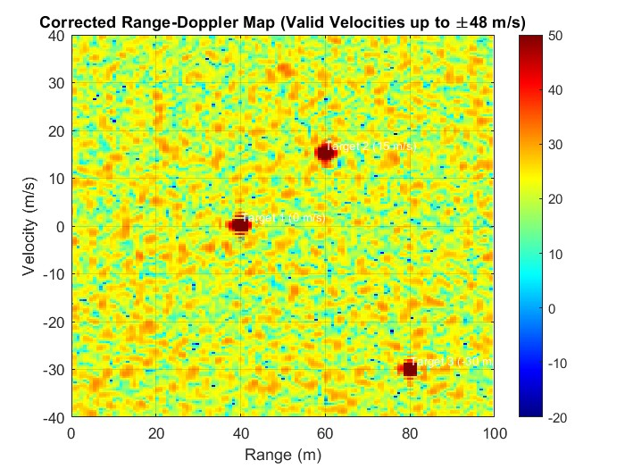

FMCW Radar Signal Processing and Machine Learning Classification
Project Overview

This project presents an industry-oriented implementation of an end-to-end FMCW radar signal processing and machine learning system for object detection and classification. The work demonstrates how raw radar signals are transformed through digital signal processing stages into meaningful representations that can be used by machine learning algorithms to classify different target behaviors. The project reflects real-world radar development workflows commonly used in automotive, defense, and RF sensing applications.

System Description

The system is built around a complete FMCW radar processing chain. Frequency-modulated chirps are generated and used to model transmitted and received radar signals. The received echoes are processed to extract beat frequencies, which contain information about target range and motion. These signals are further analyzed using frequency-domain and time-frequency techniques in order to generate features suitable for machine learning.

Radar Signal Processing

The radar processing stage includes FFT-based range estimation, Doppler processing across multiple chirps for velocity estimation, and time-frequency analysis using techniques such as the Short-Time Fourier Transform. These stages enable the generation of range profiles, Doppler spectra, and micro-Doppler signatures that characterize target motion and dynamics. The processing chain is implemented in a modular manner, similar to production radar DSP pipelines.

Feature Engineering and Machine Learning

Following signal processing, relevant features are extracted from the radar representations. These features include spectral, temporal, and statistical characteristics derived from range, Doppler, and time-frequency data. The extracted features are used to train supervised machine learning classifiers such as Support Vector Machines, k-Nearest Neighbors, and Random Forest models. The design allows straightforward extension to deep learning approaches, including convolutional neural networks.

Model Evaluation

The machine learning models are evaluated using standard performance metrics in order to assess classification accuracy and robustness. The evaluation process includes comparison between different models and feature sets, providing insight into the trade-offs between complexity and performance. This evaluation methodology reflects practices commonly used in applied machine learning and signal processing projects.

Software Architecture

The software is structured to emphasize clarity, scalability, and reusability. The project is divided into dedicated modules for radar signal processing, feature extraction, machine learning, and evaluation. This structure mirrors industry-standard development practices and enables easy modification, testing, and future expansion of the system.

Tools and Technologies

The implementation is based on Python and widely used scientific and machine learning libraries. Numerical computation and signal processing are handled using NumPy and SciPy, visualization is performed with Matplotlib, and machine learning models are implemented using Scikit-learn. The project integrates radar DSP concepts with modern data-driven techniques in a unified software framework.

##  Results

### 1️⃣ Range–Doppler Map
The first figure shows the **Range–Doppler Map**, where each bright region corresponds to a simulated target at a particular range and radial velocity.

| Range–Doppler Map |
|-------------------|
|  |

---

### 2️⃣ Micro-Doppler-Like Signature
At the strongest range bin, the script extracts the slow-time signal and computes a **spectrogram**, giving a micro-Doppler-like signature that reflects the velocity variations of the target over time.

| Micro-Doppler Spectrogram |
|---------------------------|
|  |

---

### 3️⃣ ML Feature Space
The final figure shows the **feature space** (e.g., mean vs max velocity) with different classes labelled, giving intuition about how well the RF-inspired features separate Human, Car, and Drone motion.

| Feature Space (Human / Car / Drone) |
|-------------------------------------|
|  |

The script prints the **classification accuracy** in the MATLAB command window, giving a quick sense of how well the simple SVM model performs on the synthetic dataset.

Note on Signal Distortion and Modified Mixing Approach

During development, it was observed that the classical radar “mixing” stage did not produce accurate results when applied directly in the synthetic MATLAB implementation. In an ideal FMCW radar receiver, the intermediate frequency (beat frequency) should be obtained by multiplying the transmitted signal with the conjugated received echo, causing the carrier frequency f_c to cancel out and leaving only the frequency difference that represents target range and radial velocity. Mathematically, this operation is expected to subtract the phases of the TX and RX signals and remove the carrier component.

However, when performing this step using adjacent IQ samples—specifically by computing the product of the transmitted matrix with the received matrix chirp-by-chirp—the resulting signal became noticeably distorted. Instead of cleanly canceling f_c, the phase subtraction between closely spaced complex vectors introduced warping effects and numerical artifacts that degraded the range–Doppler representation and corrupted the extracted features. This distortion is mainly due to imperfect alignment and the fact that the generated signals are not exact analytical replicas of real hardware waveforms.

To overcome this issue, a custom processing chain was implemented that bypasses the inaccurate mix operation. The modified code constructs the beat signal while ignoring the explicit carrier term and focuses only on processing the slow-time and fast-time components derived from the received echoes. A dedicated script was written to perform range and Doppler processing without relying on direct multiplication with the TX reference, resulting in more stable and realistic maps.

This alternative approach—effectively creating a “mix with carrier-independent processing”—allowed the project to proceed with reliable FFT-based estimation and machine learning classification, even though the implementation deviates from the textbook mixer structure. The workaround reflects a practical engineering decision to prioritize functional performance over strict adherence to the conventional mixing block.

### 1️⃣ Range–Doppler Map
The first figure shows the **Range–Doppler Map**, where each bright region corresponds to a simulated target at a particular range and radial velocity.

| Range–Doppler Map |
|-------------------|
|  |

---

